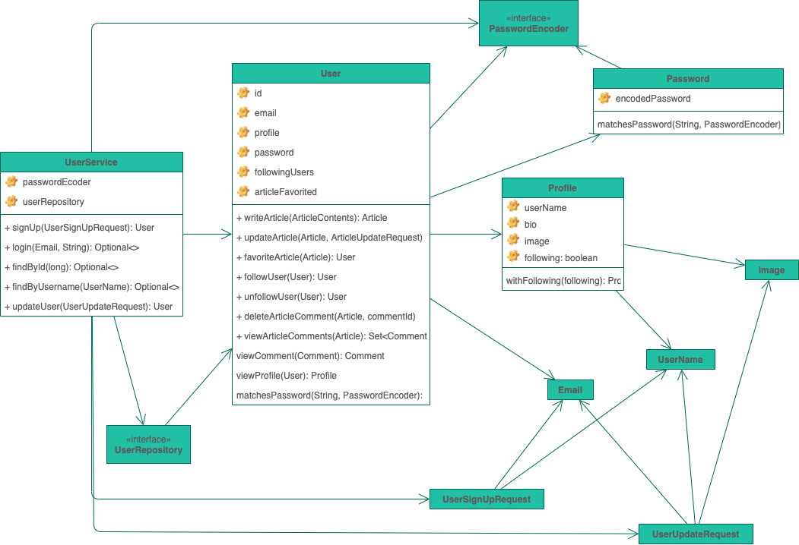
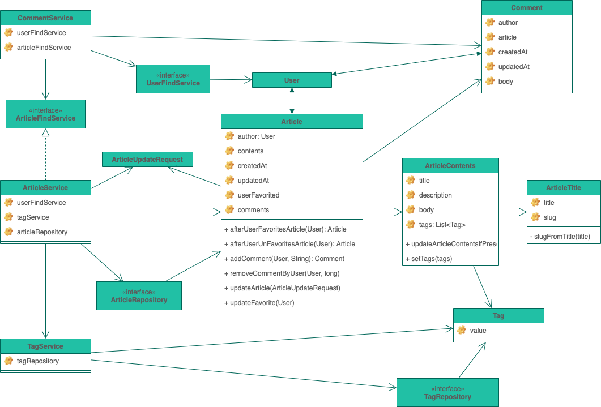
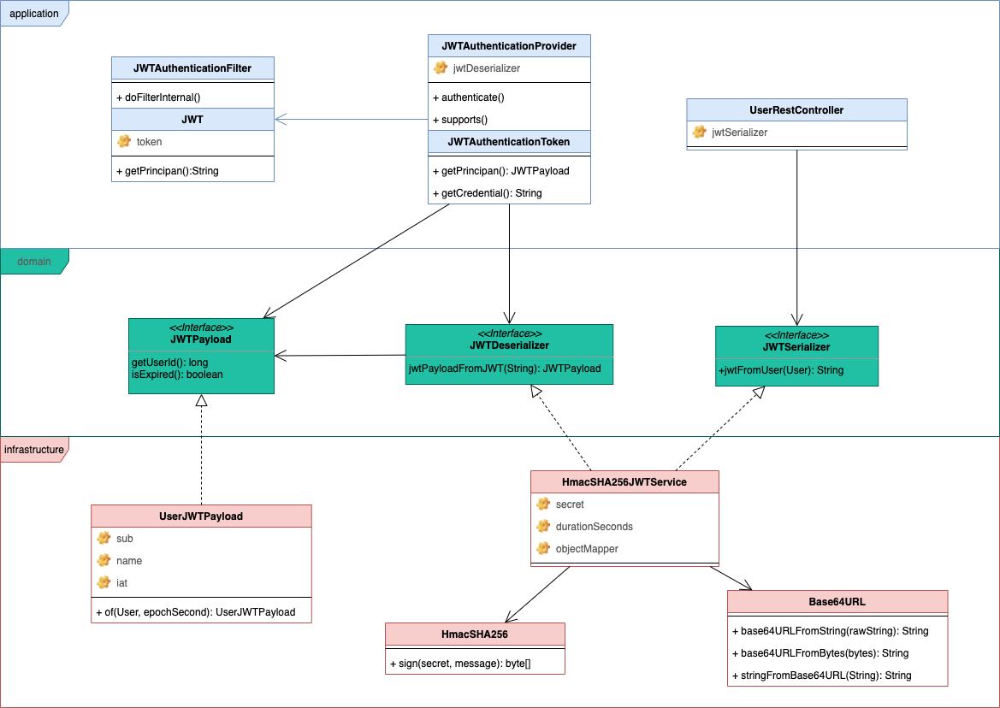
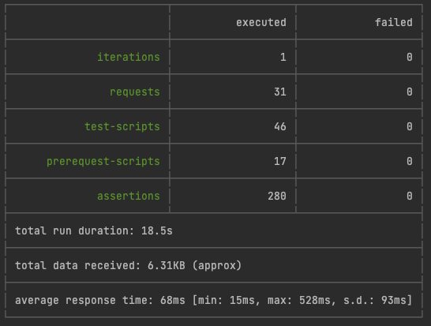

[](https://github.com/raeperd/realworld-springboot-java/actions/workflows/build.yml)
[](https://sonarcloud.io/dashboard?id=raeperd_realworld-springboot-java)
[](https://sonarcloud.io/dashboard?id=raeperd_realworld-springboot-java)
[](https://sonarcloud.io/dashboard?id=raeperd_realworld-springboot-java)
[](https://opensource.org/licenses/MIT)

[ReadWorld.io](https://github.com/gothinkster/realworld) backend project using spring boot java using `spring-security`, `spring-data-jpa`

# Insprired by

- [우아한형제들 기술 불로그 | Todo list 만들기는 이제 그만](https://woowabros.github.io/experience/2020/04/14/stop-making-todo-list.html)
- [우아한형제들 기술 블로그 | Gradle 프로젝트에 JaCoCo 설정하기](https://woowabros.github.io/experience/2020/02/02/jacoco-config-on-gradle-project.html)
- [우아한형제들 기술 블로그 | 우린 Git-flow를 사용하고 있어요](https://woowabros.github.io/experience/2017/10/30/baemin-mobile-git-branch-strategy.html)
- [Github | Realworld.io](https://github.com/gothinkster/realworld)


 # Getting started

## Configuration

The application can be configured via environment variables. Most are spring / spring boot environment variables.
The following would be the most interesting:

#### Database

By default, the application will use a volatile in-memory H2 database unless the following environment variables 
are overridden

* `spring.datasource.url`: The JDBC connectivity URL. Eg, A value of `jdbc:mariadb://localhost:3306/conduit` would
  be used to connect to a schema called `conduit` on a MariaDB instance running on `localhost:3306`
* `spring.datasource.driver-class-name`: The jdbc driver class name. Options are:
  * `org.mariadb.jdbc.Driver`
* `spring.datasource.username`: The username to connect to the database with.
* `spring.datasource.password`: The password to connect to the database with.
* `spring.jpa.hibernate.ddl-auto`: Set this to `update` when not using H2. Read more 
  [here](https://stackoverflow.com/questions/42135114/how-does-spring-jpa-hibernate-ddl-auto-property-exactly-work-in-spring) 
  *Note:* `update` is the cheap and easy solution for creating a schema which works for a simple unchanging application.
  In the future it will be best to leverage a migration tool such as [Liquibase](https://www.liquibase.com/) 
  or [Flyway](https://flywaydb.org/).

 ## Build from scratch
 ``` shell
 $ ./gradlew build bootRun
 ```

 ## Using docker
 ``` shell
 $ docker run --rm -p 8080:8080 raeperd/realworld-spring-boot-java
 ```

- Dockerhub registry is [here](https://hub.docker.com/repository/docker/raeperd/realworld-spring-boot-java)  
- Container tags are simply branch name of this repository following git-flow strategy


## How to test 

After run application, you can try one of followings

### using shell script

``` shell
$ ./doc/run-api-tests.sh
```

### using postman 

Import [`./doc/Conduit.postman_collection.json`](./doc/Conduit.postman_collection.json) in your postman application 


And also, pure `gradle test` covers almost every line of code.

More details can be found in [`./doc/README.md`](./doc/README.md) and  [original source](https://github.com/gothinkster/realworld/tree/master/spec)

# Overview

## Design Principal

- Always `final` whenever possible
- Always package private class whenever possible
- **Always test every package, class, method, instruction in codes**
  - Except for some boilerplate `equals` and `hashcode` method
  - This is validated by [jacoco-gradle-plugin](https://docs.gradle.org/current/userguide/jacoco_plugin.html).
  - Coverage verification in [`./test.gradle`](./test.gradle)
- Try to avoid including additional dependencies as much as possible
  - Implements JWT generation / validation logic without 3rd party library [#3](https://github.com/raeperd/realworld-springboot-java/issues/3)
- Try to maintain codes in domain package remain POJO
  - Except for special spring annotations like `@Service`, `@Repository`, `@Transactional`
  - Prohibit use of lombok in domain package
- Try to follow all modern best practices for spring-boot project
  
## Diagrams 

- You can open full diagram file in [`realworld.drawio`](./realworld.drawio) using [draw.io](https://app.diagrams.net/)

### User



- Separate password encoding logic out of User.
- User must be created with password encoder.

### Article



- Article contains other elements with `@Embedded` classes
- Try to reduce number of repositories.
- Prefer `@JoinTable` to `@JoinColumn`

### JWT 



- Try not to use 3rd party library
- Serialization and Deserialization are seperated with interfaces
- Domain package contains interface, infrastructure code provide implementation  
- Application package do stuff with spring-security logic

## Performance



- Result of [`./doc/run-api-tests.sh`](./doc/run-api-tests.sh)

# What can be done more

- User class doing so many things now. It can be improved someway.
- Service classes can be divided into smaller services
- Test cases order can be improved

# Contact

You can contact me with [email](raeperd117@gmail.com) or issue in this project

# License
[MIT License](./LICENSE)

# Referenced

- [JSON Web Token Introduction - jwt.io](https://jwt.io/introduction)  
- [Symmetric vs Asymmetric JWTs. What is JWT? | by Swayam Raina | Noteworthy - The Journal Blog](https://blog.usejournal.com/symmetric-vs-asymmetric-jwts-bd5d1a9567f6)
- [presentations/auth.md at master · alex996/presentations · GitHub](https://github.com/alex996/presentations/blob/master/auth.md)

